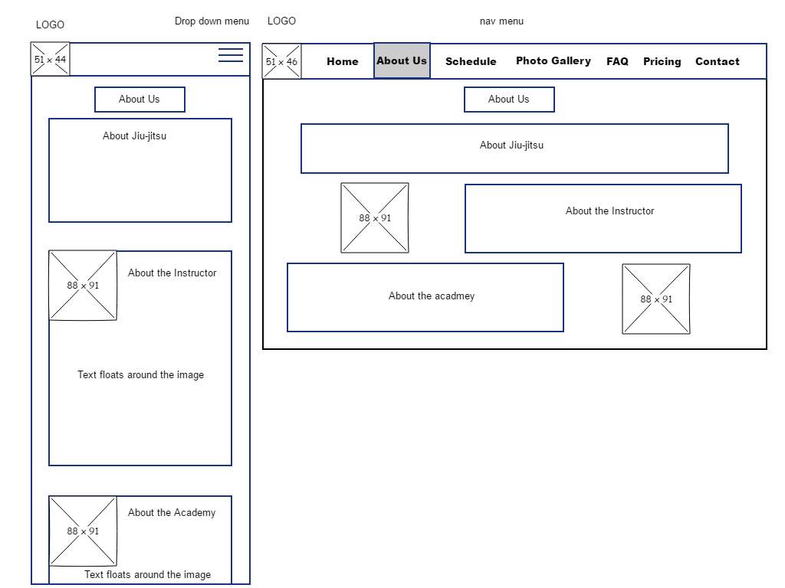
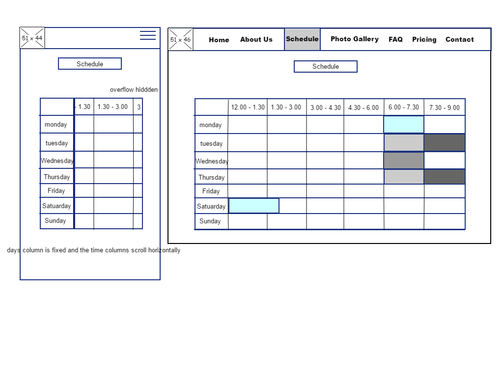
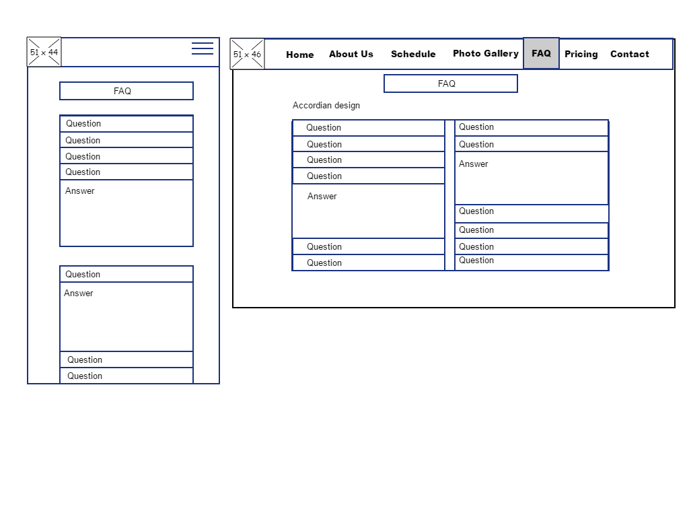
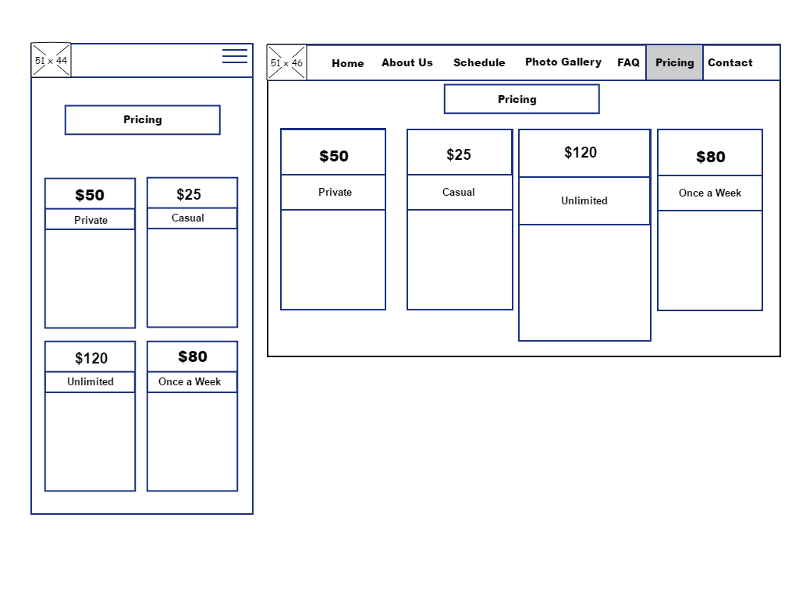
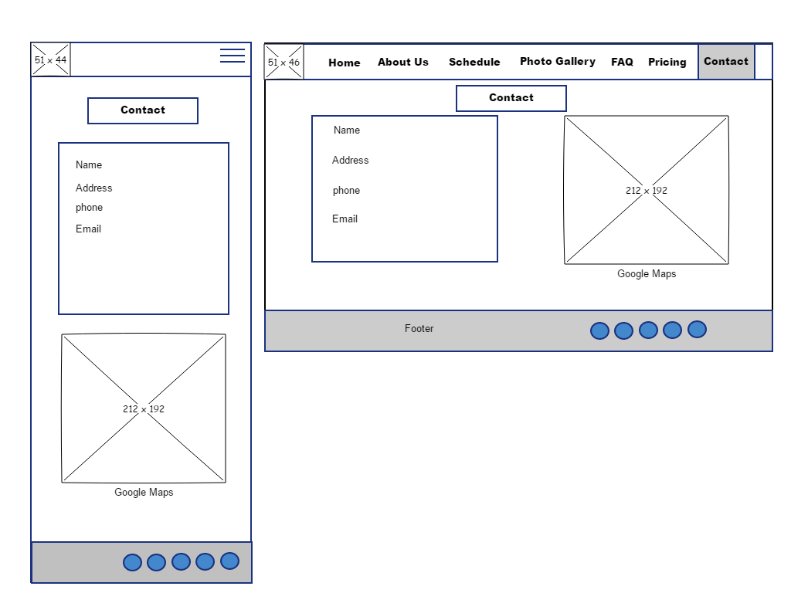

# Front End milestone project

## The Idea
For my front end project I decided to build a jiu-jitsu academy site. I thought this is a great idea because i'm a student of
the martial art, I have good knowledge in it, I believe I know the things visitors would be looking for before deciding to join and
I can use the facility I train at to take pictures and limit the amount I take off the web.

## Technologies used:
### HTML5

### CSS3

### JS
- The photo gallery uses java script code from the wc3schools website.
- The FAQ accordion also uses javascript from the wc3schools website.

### Jquerie
-The click function of the mobile device menu uses Jquery.

### Bootstrap
-I used the bootstrap grid layout to positon most elements, then customized it from that.

## Strategy Plane

### Business objectives
Who are your target audience?
- Martial art enthusiasts.
- People with an interest in learning self defence.
- People looking to improve their fitness.

### What is compelling visitors to your site?
- People searching for a reputable or closely located jiu-jitsu academy.

### Why is this site different from your competitors?
- It provides a different location from other jiu-jitsu academies which may be closer for possible recruits.
- Its team has the reputation of performing well at the national competitions.

### baseline business objectives
-increasing the number of jiu-jitsu practitioners for the academy.

## Scope Plane

### What features will be in the first release?
- Home Page.
- About: Jiu-jitsu/ the academy/ the instructor.
- Schedule/ class times.
- photo gallery.
- FAQ.
- Pricing.
- Contact.
 -Footer.

### What features will be released in the future?

- Testimonials
- ideos
- rules/ etiquette.
- news/ highlights/ seminars.

### Scenario
1. Person decides they want to start a martial art or sport.
2. Research of different martial arts.
3. Picks Jiujitsu.
4. Research of different academies and finds the closest.
5. Finds your website.
6. Gathers contact information.

## Structure

- This project will be a single scroll webpage

### Navigation Bar
- There will be a navigation bar located at the top of the page at all times with a fixed position. The mobile responsive part 
will have a menu button with a drop down menu.

### Homepage
- The homepage will host the academy name and a background picture of the academy, which i will take pictures of at the academy
I train at. It will feature a second headline tempting visitors to continue either by scrolling down or pressing the "read more"
button.

### About
- This section will feature information about the martial art, academy and the instructor. For people with little knowledge
about jiu-jitsu, this will give a brief explaination about jiu-jitsu, how it started and how it functions. About the 
academy will give you an idea of what to expect from an academy. Because vsitors would like to know "what makes this person 
a better teacher than the other academies instructor located 2 minutes closer?" About the instructor will explain and show who 
is teaching, and list some of their achievements.

### Schedule
- Visitors would like the know the different sessions and session times the are running during the week. I will describe the 
different classes and display a time table as a visual guide of the class times. 

### Photo Gallery
- An window with a sliding function. Pictures will be displayed of practitioners rolling at the academy.

### FAQ
- People have questions, Hopefully this section will answer some of them before making a decision.

### Pricing
- There will be different options of how many lessons you can do during the week depending on the plan chosen. This section will be 
close to the bottom of the page to encourage visitors to view the other page content first before making a decision.

### Contact
- This will contain the address, phone number and the email address as well as a google map image.

### Footer
- This will have the social media links to their various sites.

## Skeleton

### Wire frame:

- 
- 
- 
- 
- 
- 
- 

## Testing

- To make sure the coding was correctly made, I used w3c validator to check both the html 5 and css.
While writing the code I always had a live preview running on a second monitor.

- To test the functionality of the website I mostly used Chromes developer tools and the different responsive device modes.
Additionally I also downloaded firefox, safari and opera on my laptop, and already had edge installed. I tested my website on each of
these browsers. I couldn't test safari because the cloud 9 log in doesn't work on there for some reason.

- As apart of this project, where I could, i tried everything myself first before using third party sources. I built the time table
schedule and had to figure out the best way to make it mobile responsive which was making its overflow hidden and adding a 
scroll bar.

- I originally made up a good desktop responsive photo gallery however it wasn't so much in the tablet and mobile device modes.
I chose to go for a sliding gallery from w3schools in the end.

### Edge: 

-The first problem i encounted with edge was that my paralax background started to jump as I scrolled down the page.
I did research into this and found out it's a bug in the edge/ internet explorer programming and has no current solution
as many forums described. I later checked edge again for a further test and the flickering had stopped. 

-When the schedule timetable enters the mobile responsive mode and the scrollbar becomes active, the default scroll bar is 
semi transparent. It can be difficult to see especially since it was too close to the border of the time table. I found the 
code to change the appearance but it's not compatible on edge. I ended up moving the scroll bar slighly down so it is a bit
more destinguishable.

## Final Test

### On all devices and on browsers (Chrome, opera, firefox, edge)

- The Navigation menu testing works 
- The logo redirects to the home page.
- The "Find out more" button directs to the about "us section".
- The about section has the pictures stack under or over its related "p" element in different device modes.
- The schedule class descriptions stacks appropriately to the different device modes.
- The schedule time table resizes in the tablet mode and goes into a horizontal scrolling element in the mobile mode.
- The gallery resizes appropriately.
- FAQ resizes and stacks appropriately.
- Pricing resizes and stacks appropriately.
- The contact section resizes and stacks appropriately. Input fields all work however it doesn't direct anywhere.
- The social media links only direct back to the homepage being intentional since there are no real social media accounts for the site.

### Conclusion

- Everything is user friendly and responsive.

## References

#### Jiu-Jitsu logo:
- https://cdn.pixabay.com/photo/2012/04/24/18/15/judo-40769_960_720.png

#### Fonts from Google fonts:
- link href="https://fonts.googleapis.com/css?family=Raleway" rel="stylesheet">
- link href="https://fonts.googleapis.com/css?family=Roboto" rel="stylesheet">

- the click function of the mobile device menu:
https://www.w3schools.com/jquery/tryit.asp?filename=tryjquery_toggle

#### All the icons are from font awesome:
- https://fontawesome.com/icons?d=gallery&m=free

The box shadow css codes
- https://www.cssmatic.com/box-shadow
- webkit-box-shadow: 10px 10px 5px 0px rgba(0,0,0,0.75);
- moz-box-shadow: 10px 10px 5px 0px rgba(0,0,0,0.75);
- box-shadow: 10px 10px 5px 0px rgba(0,0,0,0.75);

#### the slide show gallery
- https://www.w3schools.com/howto/howto_js_slideshow_gallery.asp

#### This is for the accordion in the faq section
- <https://www.w3schools.com/howto/tryit.asp?filename=tryhow_js_accordion

#### google map location
- iframe class="map" src="https://www.google.com/maps/embed?pb=!1m14!1m12!1m3!1d3273.4360947450377!2d138.63722329258113!3d-34.87039399773799!2m3!1f0!2f0!3f0!3m2!1i1024!2i768!4f13.1!5e0!3m2!1sen!2sau!4v1531043627247" width="600" height="450" frameborder="0" style="border:0" allowfullscreen></iframe 

#### The description of jiu-jitsu is from:
- https://en.wikipedia.org/wiki/Brazilian_jiu-jitsu

#### The description of the academy and instructor is based from:
- http://www.sabjj.com.au/index.php/27-top-blocks/20-popularizing-and-developing-traditional-karate

#### This is for the schedule table when the overflow hidden is active and the scrollbar appears.
- https://css-tricks.com/almanac/properties/s/scrollbar/
